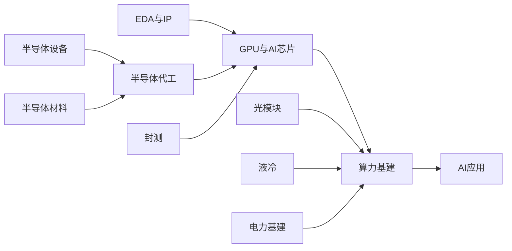

# AI产业链导航

## 产业链全景

## 按产业链层级

### 应用层

**AI应用** — 大模型、AI Agent、行业AI应用
- 公司: [[百度]], [[商汤科技]], [[科大讯飞]]

### 支撑层

**电力基建** — 数据中心电力供应：发电设备、储能、输配电、UPS
- 发电设备: [[阳光电源]]
- 储能: [[宁德时代]], [[阳光电源]]
- 输配电: [[东方电缆]], [[许继电气]]
- 公司: [[东方电缆]], [[许继电气]], [[宁德时代]], [[阳光电源]]

### 基础设施层

**光模块** — 数据中心光通信模块，AI算力互联核心
- 公司: [[中际旭创]], [[新易盛]], [[天孚通信]], [[光迅科技]], [[太辰光]]

**液冷** — AI服务器液冷散热解决方案
- 公司: [[英维克]], [[高澜股份]], [[申菱环境]], [[曙光数创]], [[飞龙股份]]

**算力基建** — AI服务器整机、数据中心建设、算力租赁
- 公司: [[浪潮信息]], [[中科曙光]], [[工业富联]], [[紫光股份]]

### 核心器件层

**GPU与AI芯片** — AI训练/推理用GPU、NPU、TPU等专用芯片
- 公司: [[英伟达]], [[AMD]], [[寒武纪]], [[海光信息]], [[景嘉微]]

**封测** — 芯片封装与测试，包括先进封装(CoWoS, HBM)
- 公司: [[长电科技]], [[通富微电]], [[甬矽电子]]

### 制造层

**半导体代工** — 晶圆代工制造
- 公司: [[台积电]], [[中芯国际]], [[华虹半导体]]

**EDA与IP** — 芯片设计工具和IP核
- 公司: [[华大九天]]

### 上游基础层

**半导体设备** — 半导体制造设备：刻蚀、薄膜、清洗、检测、光刻等
- 刻蚀设备: [[北方华创]], [[中微公司]]
- 薄膜沉积设备: [[北方华创]], [[拓荆科技]]
- 量检测设备: [[精测电子]]
- 清洗设备: [[北方华创]], [[盛美上海]]
- CMP设备: [[华海清科]]
- 公司: [[北方华创]], [[中微公司]], [[拓荆科技]], [[盛美上海]], [[华海清科]], [[精测电子]]

**半导体材料** — 硅片、光刻胶、靶材、电子特气、CMP材料等
- 硅片: [[沪硅产业]]
- 光刻胶: [[南大光电]]
- 电子特气: [[华特气体]]
- 靶材CMP: [[江丰电子]]
- 公司: [[沪硅产业]], [[南大光电]], [[华特气体]], [[江丰电子]]

### Tier 99

