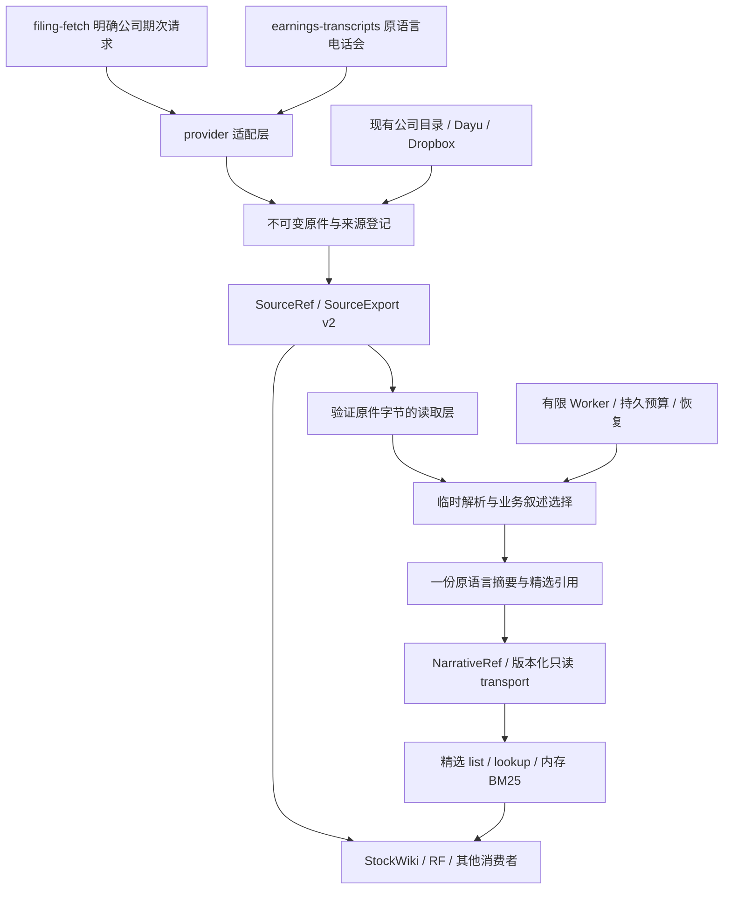

# 当前架构

> 2026-10-06。以来源事实、精选证据和有界任务为中心。

## 分层与职责

物理根、路径、文件打开与 SHA 由存储层负责。来源层负责公司/证券、期次、公开日期、版本与撤回事实；上层用逻辑引用，不为不同目录分叉业务代码。外部根只读，新下载由 CWP acquisition writer 入库；Dayu 不改代码。

解析层临时读取原文，按年报、半年报、季报、招股书、增发/可转债、IR 和电话会规则选择业务证据。覆盖不全或解析失败不能当无叙述跳过；财务表格不全量建立永久 span。摘要层只生成来源描述，保留原语言、来源 SHA、稳定 locator 和 parser/prompt/version。

检索层固定 NarrativeRef 版本，实际验证原文并回放引用，提供精确定位与精选检索；不额外持久化全文。质量 v2 只返回来源/解析诊断，metadata_only 不触发全量转换。

调度层使用现有 AUTO Store，租约、generation、attempt/effect/outbox 和预算事务统一维护；解析/HTTP 在锁外，每个子 Worker 有独立模型客户端。未知 usage 保留预留，ACK 丢失/进程中断按原 run 恢复，提交时复核来源版本。成功后只保留 final、来源和小型恢复/usage事实。

## 跨仓接口

SourceRef 2.0、SourceExport v2、narrative-ref/1、narrative-read-request/1、narrative-read-receipt/1、narrative-bundle/2.0 是已发布接口。消费者验证 producer 输出及 hash，不共享可变库，不直接读原件目录。具体字段以当前 schema/serializer/golden 为准，见[来源目录说明](source-catalog.md)和[精选接口](contracts/narrative-evidence-view-v1.md)。

StockWiki/RF 等独占研究模型与结论；company-wiki 不保存评级、目标价、仓位、估值或正式研究报告，不反向写下游目录。

## 持久数据与空间

保留原件、source/document/location/version事实、一份 final 及必要恢复资料；不永久保存整篇 Markdown 和全量财务切片。2026-10-06旧 derived/span 已清理，来源库约222MB。实际空间与来源一致性见[生产收据](plans/narrative-evidence-pilot-2026-09-26/harness_lanes/results/s5_production_storage_acceptance_2026-10-06.json)。这不表示所有历史资料都已运行新模型。

## 自动验证

各层测试针对自身职责：存储的字节与原件保护、来源的身份/时间、解析的选择与回放、摘要的原语言与绑定、调度的预算与恢复、消费者的 wire/收据。日常 commit 静态、push 短 smoke、CI 全 Unit；跨层真实 E2E 在大节点集中运行。旧 Reviewer/签收锁不参与运行。

Source Export v1 / IngestService v1 和 legacy Wiki 仅为明确兼容内容；历史架构可从 Git 查询，不作为新流水线施工指令。当前未完成项以[主计划](plans/narrative-evidence-pilot-2026-09-26/task_plan.md)为准。
