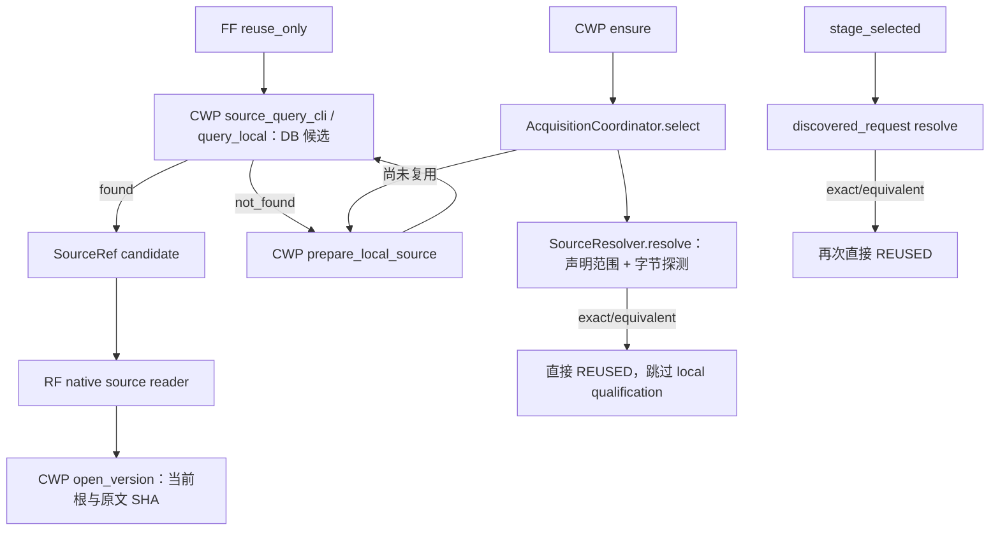

# W06 共用资格入口：独立层次审查建议

日期：2026-10-09。只读架构建议，不是修复实现或最终验收。读取 W06 工作树 `C:/Users/郑曾波/.codex/worktrees/audit-provider-cause/company-wiki` 的当前文件（交付 HEAD `d44421fa`，作者修复仍可能未提交），以及现行 `Projects/filing-fetch`。没有重跑作者正在调查的 FF 反例，没有改代码、原件、配置、共享计划或已留存的 FAIL；外部/付费调用为 0。

## 结论

真正缺口是 **候选声明、原文字节、原文事实、请求资格四个层次被当成了同一件事**。当前本地准备修好了原文事实资格，但 ensure 的两条复用捷径和 FF 的查询命中路径没有经过它。因此不能只在某个 CLI 上增加一句 `prepare_local_source`，更不能让 FF/RF 分别解析 SEC 原文。

建议把“已验真字节/已有 SHA 绑定事实 → 来源范围观察 → 请求资格”提取为 CWP 的一份共用实现，由请求选择/显式本地修复/最终请求型打开调用。通用原文打开继续只负责版本、存储位置和完整字节；原文预览不需要满足收入预测的期次。目录查询继续是 DB-only 候选发现。新的资格结果是来源事实判断，不是人工授权。

## 实际调用图与绕过点

现场文件位置（作者仍在修改工作树，行号为本次读取时）：

| 位置 | 实际职责/缺口 |
| --- | --- |
| `acquisition.py:372–398` | `select` 调 `SourceResolver.resolve` 后 exact/equivalent 直接返回 REUSED，`prepare_local_source` 在 409 行才调用。 |
| `acquisition.py:475–504` | `stage_selected` 发现目标的复用分支也直接返回；只修 select 仍遗漏第二入口。 |
| `resolver.py:1282`、1654、1784 | 现有 resolve 用索引声明筛选期次，然后 `_select_candidate` 校验字节并 `_handle` 构造句柄；当前事实并不因 SHA 正确就自动与声明相符。既有 claim-only legacy canonical 回退更不能充当 qualified reuse。 |
| `local_reconcile.py:237/276/488` | 这里已有 SHA/DEI/issuer 绑定缓存检查、原文 scope、相关性先于日期/缓存处理、显式事实修复。这些算法不应只藏在 local writer 内。 |
| `source_reader.py:270/480` | `query_local`、`describe_candidate` 是 DB-only，返回 found/candidate 不等于实读资格。其注释已经写明这一点。 |
| `source_reader.py:620/647` | 通用 `open_version` 验证当前原件版本和字节，不接收完整 SourceRequest。仅在这里强加预测期次，会污染原文预览/export 职责。 |
| `source_reader_cli.py:62/66` | 当前先 open 后另 describe。合成请求型读应利用已有 `open_described_version` 的单读上下文，保证资格使用的 manifest 与返回字节属于同一观察。 |
| FF `fetch_filing.py:757–798/1109/1218` | SourceRef reuse-only 查询命中直接发 provisional candidate；只有 not_found + v2 reuse_only 才显式 prepare。candidate 本来可以是 provisional，缺的是消费者最终打开时的 CWP 请求资格，而不是迫使每次 query 写库。 |

CodeGraph 主仓索引可用（994 files）；先用其 status/context/node 确定通用 reader/resolver 结构。主仓索引没有 W06 新 `prepare_local_source`，所以该新分支及实际快捷路径按已知文件只读核对；没有新建/改写索引。

## 推荐职责边界

### 1. 纯来源范围资格：放在 CWP，独立于存储和 writer

优先在既有 `qualification.py` 增加独立内部函数/结果类型，或独立小模块 `source_scope.py`（二选一）。不要改变现有 `source-qualification/1` 的发布日观察 schema；更不要新增 proof 表/库。

共用函数的输入必须是已经过所属字节层校验的 **同一原文 buffer**、SourceRef、当前事实/已有 source_fact_evidence、已解析一次的 issuer observation、预期 SourceRequest 或明确的来源自洽范围。它不找目录、不下载、不再 SHA 整份原文、不扫描配置、不自己重新 identify 公司。

内部结果建议分开表示 `match / not_relevant / unknown / contradicted`，附已有 facts/evidence 或有限原因。SEC 原文字段仍用现有 `extract_sec_scope → complete_sec_primary`；把 `_scope_matches`、`_reusable_sec_scope` 及 `_proven_facts` 中的范围判定归到此处，不在新函数里复制第二套算法。publication/as-of 仍调用现有 `qualify_source`；正文无法证明的发布日继续 unknown。

范围比较、日期解析、provider cache 验证要保留顺序：先实证 issuer/year/period/form，再判断是否相关；真正旧期间且没有“索引宣称此次命中”的冲突，可以在无关日期或旧 provider cache 报错之前排除。索引宣称命中但原文否定、同期间坏 SHA、未知范围/发布日期，不能被写成“无原件”。

### 2. 请求型候选选择/打开：CWP 一份组合服务

新增明确的内部 `resolve_qualified(request, context)` 或 `open_qualified_candidate(ref, request, context)` 组合入口，名字可调整，责任不能分散：

1. DB-only 发现/选定候选；
2. 所属 reader 在当前配置/版本/根规则下打开目标一次，返回 verified buffer 和该次 manifest observation；
3. 调上述共用资格函数；
4. 如为显式 intake 且需要修正，交已有 `restore_document_facts` 在原 catalog 锁/事务下追加事实；read-only consumer 不自动写库；
5. 返回符合请求的来源结果或具名失败。

`query_local` 保持 DB-only。`open_version` 的通用版本/字节职责保持。`preview`、普通原文 export 可以读到错期或范围未知的真实原件；它们不应因预测期次不匹配失去预览能力。请求型 filing evidence 打开才要求其任务需要的范围字段。

**FF found 分支需要特别分清语义：**它可以继续返回 provisional SourceRef，RF 要在 CWP 的请求型最终打开处消费完整 expected scope。目前 native reader 只带 ref/purpose，RF 局部比较又不等于 CWP 的原文范围资格。若只在 CWP 做“原文与当前 manifest 自洽”，能挡住已发现的错 CIK/错 FY 两反例，但不能宣称覆盖任意候选与请求的所有 kind/period 差异。完整方案应把当前请求的 kind/year/period/issuer/as-of 作为 **普通任务参数**传入 CWP scoped read（可用有界可选 CLI 参数，不是授权文件）；RF 只转发现有参数，不新增自己的 SEC parser 或 gate。现有 generic CLI/receipt 保持兼容。

### 3. ensure 与 after-discovery 必须统一消费 qualified 结果

`AcquisitionCoordinator.select` 的初始命中与 `stage_selected` 的 after-discovery 命中都通过同一 CWP qualified service。`latest_as_of` 仍按既有规则做 provider 元数据新鲜度发现，不能用一个本地来源推断“最新”。范围 unknown/conflict 不能触发另一份下载；只有实证不相关/确实缺少目标的结果才允许走原有 acquisition intent。

不要采用“先 resolver 把文件 SHA 一遍 → prepare 再 SHA 一遍 → resolver 又 SHA 一遍 → consumer 又解析一遍”的方案。应拆开 resolver 的候选/legacy handle 投影与其已有探测：请求型复用从 qualified observation 构造原有 ResolutionResult/SourceHandle。兼容 resolver 旧路径可保留声明候选语义，但不能成为 ensure 的资格证明。

## 正确缓存和一次目标验证

- 现有 append-only `source_fact_evidence` 足够承载事实提取缓存。缓存命中至少绑定 source_id/content SHA、相关提取方法/version、字段 locator/value，以及 issuer record 的当前绑定。普通 canonical import 标签或仅 form/title 的 patch 不算完整 DEI scope proof。
- 缓存是**事实提取缓存**：正确命中不再解析 DEI、不重新提取 title。当前目标原文在本次真实打开时仍完整 SHA/size 一次；mtime、路径名和旧 receipt 都不能代替当前字节。
- 一个 CWP 请求中使用一个 immutable observation/context，issuer lookup 一次，预算对象一次。把已验真的目标 buffer 传给 extractor/writer/投影，不能再打开同一目标做第二遍最终 SHA。锁内 catalog 观察改变则给出原有并发失败/有界重试，不接受旧目标证明。
- `SourceResolver.resolve` 目前对注入预算调用 `begin_request()`（1325 行）。新组合路径不能在每个子调用重置这个共享对象；只在外层创建请求时初始化。metadata、实际枚举、原文验证沿用 W06 同一 LocalReadBudget；网络响应仍按 AcquisitionBudget 独立计费，并共享外层剩余时间。
- 独立 CLI 进程在稍后的真实消费时再次字节验真，是一次新的读操作，不能把另一进程之前的 verify 当作现时字节。如果要求跨进程也只实读一次，应让最后打开承担原文校验并把前段结果维持为 candidate；不要使用可伪造的文件 proof 或再建长期 buffer 存储。
- 多个物理同 SHA 副本的 fallback 仍由字节/位置层负责；只需正常目标读命中一次，失败副本的必要读尝试如实计账。来源修复事务若确实要检查多个待恢复 location，不能把真实额外读伪称为一个物理读。

## 哪些文件需要改，哪些接口不变

| 文件/层 | 必要职责改动 |
| --- | --- |
| CWP `qualification.py` 或小 `source_scope.py` | 纯共用范围事实/请求资格；不改现有发布时间 wire。 |
| CWP `local_reconcile.py` | 将已有范围算法抽出并调用；继续负责显式 discovery/metadata 修复，不再垄断范围资格。 |
| CWP `source_reader.py` | 提供使用单 verified buffer 的请求型组合读；通用 preview/open 的字节 API 保持。 |
| CWP `resolver.py` | 请求型候选选择与已有 handle 投影分开；不要 qualified 后再运行旧 hashing 选择，不把 claim-only fallback 当 ready。 |
| CWP `acquisition.py` | select、after-discovery 两复用出口共同消费 qualified 结果；不要各写一套 issuer/FY 验证。 |
| CWP `assertion_service.py` | 原 fact_replay/锁内一次 verified original 可继续复用；仅在需传递同一 observation 时窄幅调整，不造新 proof writer。 |
| CWP `source_reader_cli.py` | 请求型参数派发/原 receipt 投影；使用单读上下文。通用打开仍兼容。 |
| RF native reader adapter（如选完整 scoped read） | 只将已有 expected scope 转发给 CWP，保持现有消费 SHA/receipt 校验；不新增原文事实算法。此跨仓写集由 MAIN 协调。 |
| FF `fetch_filing.py` / `ff_local_source_prepare.py` | 保持 found 的 provisional 声明及现有 named-failure 映射。只有协议传递实际需要才窄幅改转发/映射；不要 found 时无条件再做 discovery、full scan 或写库。 |

SourceRef 2.0 六字段、manifest key set、verified-open receipt 2.1/2.2、六字段 `filing-upstream-cause/1`、既有 local prepare schema 和 accounting usage/limits 均不用扩展。内部结果/普通请求参数不构成许可。新增 finite reason 若确有必要，只更新一处 CWP 定义和现有消费 allowlist/映射；不添加任意正文错误或不兼容的 receipt 字段。

## unknown、contradicted 和 absence 给消费者的区别

| 原文/请求关系 | 应有结果 | 下载/消费含义 |
| --- | --- | --- |
| 原文范围证实符合请求，日期符合 as-of | qualified match / ready | 可以复用；对真实 verified buffer 生成已有 receipt。 |
| 原文证实为别的期间，未被当前索引宣称命中 | not_relevant | 排除该文档，继续有限候选；只有所有目标候选确实缺失才允许取得 missing。 |
| 当前命中声明与原文年/期/form 不一致 | contradicted / blocked；已有 `primary_scope_conflict` 内部，公共可映射 `source_period_mismatch` | 不能返回 reused、不能表示原件不存在，保留原件可预览。 |
| 当前公司声明与原文 CIK 冲突 | contradicted / blocked；`primary_issuer_conflict` →公共 `source_identity_mismatch` | 不能用另一份下载掩盖事实冲突。 |
| 所需范围缺少可靠观察 | unknown / metadata gap | 有原件但任务资格未知；不能猜公司/期次，也不能伪装 not_found。建议公共有限 `source_scope_unknown`；若用既有有限词，必须确保仍能与 contradicted 区分。 |
| 日期缺少/超出 as-of | 继续既有 publication unknown/after-as-of 观察 | 不把 PDF 创建日、抓取日或本次 read_at 变成发行日。 |
| 字节/路径/预算/截止时间失败 | 既有 unavailable/blocked 有限原因 | 停止相应操作；不能吞掉错误再返回 empty lake。 |

这些是处理结果，不是审批门。已有 FF 的 local_metadata_gap 与 no_registered_local_source 分别对应“有原件但缺可靠事实”和“零原件”；保持 distinction，传递先前 attempts/calls/downloads 与已知/未知费用，不将它们重置为成功的 0。

## 最小集中验收建议（不增加小节点审查）

在该共用责任完成后做一次集中大节点：已有 local_prepare 两真实反例 + ensure 两捷径 + FF provisional→最终 scoped read，同一 bad-CIK/bad-FY fixture通过全部入口拒绝；正常目标缓存命中不解析第二遍且单目标 byte-read 计数为一；generic preview 仍能打开同一坏范围原件；旧期间坏 date/cache 仍排除；unknown scope 与零原件、预算耗尽分开。真正运行 CLI 与目标 read-count 控验，避免只断言一个 monkeypatch helper 被调用。

这里没有再次执行或宣布这些测试通过；作者当前 FF/ensure 控验负责提供 RED，MAIN 按共用层修复后完成一次集成验收。
