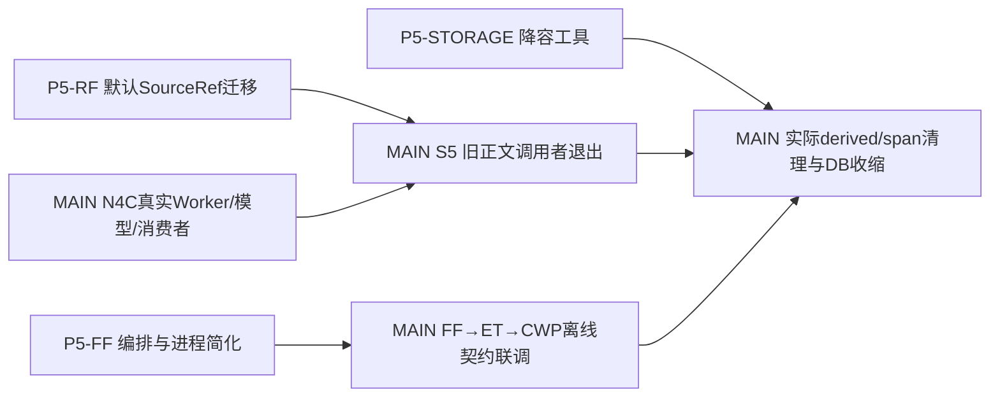

# P5并行施工总包：来源默认迁移、FF简化、存储降容工具

<!-- CURRENT_PWF_NAV -->
> **历史施工/调查材料：**当前状态与唯一下一步见[总计划](../task_plan.md)。下方旧待办、暂停、人工签收和预算只是当时记录，不自动恢复；R3/R5的真实剩余范围以总计划为准。

状态：**三卡均已交付、MAIN验收并发布，不再派发。** 本页保留2026-10-05开卡范围及交接格式；当前剩余工作属于MAIN，不是外线交付屏障。

**P5-RF再次交付通知已核对（2026-10-06）：**交付a74b9ceb完整在本地/远端main6e6b817a中，交付树干净，无新提交；代码ca67eab7的CI37391526925 attempt1 success。RF卡过期ready标题已修正，详见[正式验收](results/p5_rf_main_acceptance_2026-10-06.json)。不重复并线或长测；MAIN下一节点仍N4C。

**2026-10-06最新复核：**FF外线ab9ce33完整包含于远端main758e8f4；STORAGE外线7ac1e3d/f8f414a经选择性吸收及修复进入master（集成9fa2166、后续96f44a1），不要求再merge旧分支。两外线工作树均干净，没有新增交付；GitHub官方API复核三个精确代码CI37385101051、37375836745、37394193179均attempt1 success。CWP本地/远端master均ed86940，实际生产清理及来源事实验证已完成，净释放5.659GB，见[生产结果](results/s5_production_storage_acceptance_2026-10-06.json)。不重复长测试或清理操作；S6说明/控制/钩子收尾已发布e481578、精确CI37399248994一次全绿，MAIN下一动作是N4C真实模型批次，累计token cap答复待定。

**最新进度覆盖（2026-10-05）：**STORAGE已验收合入/发布e570daf、53个不同case分步GREEN，生产未删。FF交付ab9ce33及MAIN实际修复均已合入/推送main758e8f4，本地main同步/仅凭证未跟踪，53个不同节点case分步GREEN、37项进程责任包/三仓离线链/固定真实年报读取通过；精确CI37385101051 attempt1全部步骤GREEN，先前58568e7的Linux类型失败已具体修正，无盲rerun，[FF验收收据](results/p5_ff_main_acceptance_2026-10-05.json)。RF已验收并推main ca67eab7（默认链代码b110502f）；精确CI37391526925一次全绿、job32秒。本地正式revenue-forecast已切main同步，旧rf-impl WIP原样保留在独立分支；三处已安装来源入口SHA与主线一致。MAIN质量v2与正式精选检索1b0feb4已发布/精确CI绿，后者102个不同case分步GREEN；N4C模型cap问题不阻该离线迁移。下面f775406等为开卡基线，不是当前MAIN HEAD；三卡不重派。

正式精选检索已发布1b0feb4、CI37381429717 attempt1 success。FF预验收发现的cap、stdin期限、单流overflow/双EOF继续运行、孙持pipe和早派生问题均已通过实际子进程复核；[原预验收细则](results/p5_ff_main_preacceptance_2026-10-05.md)保留历史过程，新状态以MAIN收口记录为准。三仓线已汇合，没有三线全交付屏障。

## 分工与物理隔离

| 包 | 工作量与产出 | 源仓库 | 独占施工目录（新建worktree） | 施工卡 |
|---|---|---|---|---|
| P5-RF | 较大：把真实来源准备入口和调用者迁至现有SourceRef v2，退出旧normalized正文依赖 | `C:/Users/郑曾波/Projects/revenue-forecast` | `C:/Users/郑曾波/Projects/cwp-lanes-20261005/rf-source-v2` | [RF卡](p5_rf_source_default_migration.md) |
| P5-FF | 中等：删除旧Worker暂停/恢复编排；让JSON进程限额在读取期间生效 | `C:/Users/郑曾波/Projects/filing-fetch` | `C:/Users/郑曾波/Projects/cwp-lanes-20261005/ff-runtime-cleanup` | [FF卡](p5_ff_runtime_simplification.md) |
| P5-STORAGE | 较大：实现旧derived/span处置和VACUUM工具，在隔离真实schema上证明可恢复及原件不丢 | `C:/Users/郑曾波/Projects/company-wiki` | `C:/Users/郑曾波/Projects/cwp-lanes-20261005/cwp-storage-tool` | [存储工具卡](p5_storage_retirement_engine.md) |
| MAIN | N4C真实模型/Worker、RF N3a实读；CWP核心调用者迁移与最终生产清理、合入、总PWF | company-wiki | `C:/Users/郑曾波/Projects/company-wiki` | 总计划Next Step |

三个外线目录是互不包含的兄弟目录，均不是原仓活动checkout。P5-STORAGE的源码属于company-wiki，必须在指定新worktree施工；它只新增`tools/legacy_storage*`和专属测试，不改MAIN的`src/`、现有测试或配置。各线有自己的分支/index，不共用一个目录运行。

## 核过的现状与拆分理由

- CWP发布`f775406`，selector `0.3.0`，SourceRef/NarrativeRef/wire已稳定；本机仅用户`config/source_acquisition.yaml`dirty。
- RF正常账号：fcap `5319ee26`，已发布main `8a153f33`；两份assurance weekly owner改动保留。main来源准备仍`source_reader_v2=False`并打开旧artifact，而现有v2代码及三仓E2E可复用。P5-RF从main开始，不从fcap的旧实现开始。
- FF发布main `d4d2fac`，tracked干净。v2 CLI已自动走SourceRef，不需要重复实现；源码仍有`PausedWorkerScope`、pause refcount/owner文件、status/pause/resume调用。JSON runner先`capture_output`再限长，主filing runner还用字符数当bytes；这两项是本卡实际缺口。
- StockWiki `master@01a42894`tracked干净，现成narrative consumer已交付；ET `main@63c4090`tracked干净，deadline卡已交付。本轮不为凑数重派它们。IQS有独立项目，Dayu纯外部，均不进入写集。
- 旧derived历史实测2,826,010,634 B，DB约3.06 GB/1,490,530旧span；这些是候选规模，不是已释放空间。旧prune-retired只处理retired来源，不能解决全部active旧span；存储包实现工具，实际清理仍由MAIN在消费者迁移后执行。

## 已发布接口冻结与独立性

1. SourceRef `2.0`、SourceExport v2、原文verified-open receipt按现有producer serializer/golden消费；不新增跨仓wire版本。
2. 叙述使用`narrative-ref/1`、`narrative-read-request/1`、`narrative-read-receipt/1`及`narrative-bundle/2.0`。RF N3a/StockWiki现成能力不重写。
3. FF现有`--source-ref-v2`继续接受，RF包可以向当前已发布FF显式传它；FF包不改变SourceRef/candidate及companion wire。因此RF、FF不互等。
4. 存储包只读取当前schema/adapter源码，新增工具不改CWP服务/DDL，也不写生产。测试里的执行和VACUUM仅作用于本卡fixture。消费者迁移是**生产执行**前置，不是本卡编码/交付前置。
5. MAIN保留共享接口与核心代码所有权；外线不得跨仓写文件、安装全局技能、下载、调用付费模型、合main或执行生产清理。分支可正常提交；有remote可推自己的`codex/`分支，无remote不创造remote。

源码依赖与真实原文只读；测试复制进自己的独立根，并记录固定producer HEAD及真实SHA。不要依赖MAIN未提交文件。单仓测试可用现有测试辅助，但运行时代码不导入他仓内部Store或Python实现。

## 合入与汇合

没有三线全交付屏障。MAIN收到一包即可审diff/接口/责任测试，正常合入其源仓目标主线；不重复跑整套历史验收。



MAIN保持本机配置/原件和其他owner工作。production清理前只做一次存储大节点验收：迁移真实入口、原件实读、新final回放、旧引用去向、字节/DB释放、恢复/幂等。不是每个helper或文件人工签收。

## 统一交接格式

每包在**自己的worktree**提交：`docs/implementation/handoffs/<LANE_ID>/HANDOFF.md`和`handoff.json`。独立PWF放`.planning/<lane-id>/`，仅由该线维护；不写CWP总PWF。MAIN收到后复制必要短收据并更新总表。

`handoff.json`格式（操作交接资料，不是新的运行授权文件或签名门）：

```json
{
  "schema_version": "cwp-parallel-handoff/2",
  "lane_id": "P5-RF | P5-FF | P5-STORAGE",
  "status": "complete | no_change_needed | partial",
  "repo": "source repository absolute path",
  "worktree": "this lane absolute path",
  "branch": "codex/...",
  "base_head": "40-char SHA",
  "delivery_head": "40-char SHA",
  "commits": ["40-char SHA"],
  "changed_paths": ["repository relative path"],
  "upstream": [{"repo": "company-wiki", "head": "40-char SHA", "interfaces": []}],
  "entrypoints": [{"command": "exact runnable example", "output_contract": "existing schema or tool report"}],
  "tests": [{"command": "exact command", "exit_code": 0, "passed": 0, "failed": 0, "skipped": 0, "elapsed_seconds": 0}],
  "real_samples": [{"kind": "annual_report", "source_sha256": "64 hex", "metadata_is_fixture": true}],
  "cleanup": {"test_root": "absolute path", "before_digest": "digest", "after_digest": "same digest", "restored": true},
  "protection": {"originals_unchanged": true, "owner_files_unchanged": true, "production_written": false},
  "calls": {"network": 0, "download": 0, "llm": 0},
  "metrics": {},
  "integration_notes": [],
  "remaining": []
}
```

上面是字段模板，不得原样提交占位字符串、0计数或`true`当证据；改为实际数值。正常平台skip说明能力边界，不伪装为通过；E2E未执行给明确原因。若发现基线已完成全部缺口，提交简短`no_change_needed`证据，不制造重复实现。

`delivery_head`指最后的功能/测试提交；handoff文档可随后另commit，无需把包含报告本身的commit SHA反复写回报告。`commits`列功能范围，MAIN另从Git读取当前交付分支tip。清理根起初不存在时before/after digest可填`absent`，并明确两个状态。`calls`计真实外部network/provider/LLM；本地Replay、fake-provider及fixture下载事件另填metrics，不能用它们伪称真实API测过，也不能把实际download outcome/count清零。

MAIN验收看实际commit/diff、公开入口、已执行测试、临时根恢复和资源/原件事实；不增加人工review receipt/授权JSON。外线交付不代表已经合入main或生产数据已清理。


## 2026-10-05 集成交付状态（历史快照，不产生当前待办）

- P5-STORAGE已完成MAIN两节点TDD/真实资料验收，候选9fa2166已合入并推到master@e570daf；53个不同case分步GREEN，测试根恢复。专属慢测试在integration；不重派本卡，也不凭工具通过执行生产删除。正式receipt见results/p5_storage_integration_acceptance_2026-10-05.json。
- RF远端main仍8a153f33；RF/FF HANDOFF均已收到，FF已正式验收并线，RF按MAIN整合细则验收。保持独立owner写集。MAIN继续CWP旧底层caller/metadata_only语义，收到两线后再集中联调并线，生产清理由MAIN在实际caller退出后执行。
