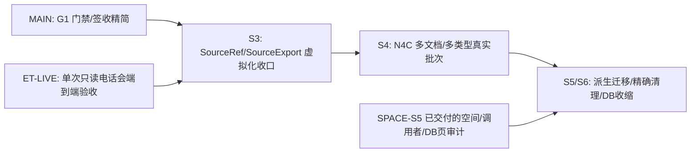

# S2–S6 并行实施总图与总指挥责任

> 2026-10-03 最新施工安排，补充而不替代 [task_plan](task_plan.md)。旧 W01–W04、SourceExport、工程门简化和 G-C 消费线已经交付，不重复派发。本页及各施工卡由 company-wiki 主线 owner 维护；外部 harness 只改各自工作目录。

## 结论与现在能启动的任务

原三条外部分工均已交付：ET-S3 与 FF-S3 已合并发布，SPACE-S5 报告交回 root 实施。当前主线优先完成 G1 门禁精简，其次收口 S3 SourceRef/SourceExport 虚拟化。唯一新增的无冲突包是 ET-LIVE 只读原文导入验收；它只写自己的结果文件，代码缺口由 G1 完成后的主线修复。

| 线 | 当前状态 | 独占写入目录 | 本次内容 | 独立卡 |
|---|---|---|---|---|
| MAIN：本对话/root | active | `C:\Users\郑曾波\Projects\company-wiki` | 第一优先 G1 门禁/签收精简；第二优先 S3 SourceRef/SourceExport 虚拟化收口；之后 N4C 真样本并发、S5/S6存储清理及所有跨仓代码集成 | [总计划](task_plan.md)、[N4](n4_production_batch_implementation.md) |
| FF-S3 | merged/pushed to main (`1d0c73c`; CI success) | `C:\Users\郑曾波\Projects\filing-fetch-s3-limits` | 一请求、实际限额、v2/薄 v1、latest_as_of元数据查询预算语义已与CWP CNINFO bounded provider闭环；真实资料E2E通过；Linux mypy平台错误已修复 | [FF 独立卡](harness_lanes/s3_filing_fetch_single_request_limits.md) |
| ET-S3 | merged/pushed | `C:\Users\郑曾波\Projects\earnings-transcripts-s3-runtime` | 已合 earnings-transcripts main，merge commit `93fe52c`；同步阻塞 HTTP/显式翻译超出 retrieval budget 的语义仍未证明为硬总时限 | [ET 独立卡](harness_lanes/s3_earnings_transcripts_runtime.md) |
| SPACE-S5 | audit delivered; root implementation pending | `C:\Users\郑曾波\Projects\company-wiki-storage-audit-20261003` | 只读 B2 调用者/库页/原件精确重复量完成，报告在 `results/storage_audit.{json,md}`；生产清理不在该包范围 | [空间审计卡](harness_lanes/s5_storage_audit.md) |
| ET-LIVE | ready / read-only acceptance | 只写 `harness_lanes/results/et_transcript_live_import_acceptance_2026-10-04.md` | 最多一次真实电话会取数；验证原语言原件→临时CWP canonical import→SourceRef/SourceExport pathless read；无生产代码/config/仓库写入 | [独立验收卡](harness_lanes/et_transcript_live_import_acceptance.md) |

“ready”表示可以开工，不能解释成有 harness 已经在做。用户启动后把线名交本对话登记为 running；root 从那时起不再实施其仓内工作。没有消息回传也不推测交付。工作目录已存在时先读 status/计划，复用同线可用目录；不覆盖不明目录。

## 总指挥做什么

1. 我独占 CWP、总 PWF、对外 producer 接口和全局 `.agents/.codex` 技能安装；保持 S0–S6 唯一顺序。其他线不能修改这些目录，避免把总计划写成多份状态真相。
2. 冻结以下接口，把未实现状态写明。FF/ET 在自己的仓内按接口做测试和实现；接口变化先交 root 协调，不能各自换版本或改另一仓。
3. 接收各线 commit 和小型交接报告，核实际 diff/相关测试，再做一次跨仓大节点测试。普通 Git 合并；冲突由我处理。root 合并某仓期间该线冻结写入；不要求每个小步骤签收。
4. 我负责真实原件、最终包/消费者、恢复和空间的总体验收；只读审计线没有删除权。测试完恢复独立目录原样；原件仍全部保留。
5. 我统一更新主线进度并及时 commit/push。没有 remote 的项目只报告本地提交，不虚报已推送。外线只 push 自己的 `codex/` 分支，不自行切默认主线/安装全局技能。

## 已冻结接口与真实完成状态

### I1：FF → CWP 来源操作

- 保持现行 SourceRef `2.0`、v2 filing 请求与响应语义；上下游只传 ID/hash，不传原文物理目录，不写共享数据库。
- 当前 FF `acquisition_limits` EXACT 字段：`max_bytes` 正整数、`timeout_seconds` 正有限数、`max_cost_usd` 非负十进制字符串（当前支持最多两位小数）。`reuse_only` 不接受采集额度。
- FF v2 `acquisition_limits` 已进入 CWP producer adapter；CWP配置上限、单调deadline及剩余额度传到 bounded provider，不只做JSON形状校验。新增长期CLI flag不是当前合同的一部分，不再要求额外增加一套调用入口。
- 对旧 producer 未识别参数，FF具名失败，不能删除限额重试或悄悄走v1；provider缺少真正bounded transport时保持fail-closed。Dayu不改。
- 状态：FF `1d0c73c`、CWP producer `288b028`、StockInfo bounded provider `8ed5fdd` 已通过真实BYD FY2024 CNINFO端到端（下载10,092,140 B，raw与SourceRef SHA/size一致）；`latest_as_of + reuse_only` 与legacy精确复用未发生下载，缺件且无预算时在写入前失败。该路线已完成，剩余虚拟化缺口见I2和总计划S3。

### I2：FF → ET → CWP 电话会

- 工具位置来自 `EARNINGS_TRANSCRIPTS_TOOL`；调用 `--request-stdin --include-source-payload`。
- 请求 `earnings-transcript-request/1`，精确证券/市场/FY/Q；ET 返回现行 `/2`，原语言原始 payload/text/hash；CWP import `/2` 请求、`/3` 响应。年度报告不猜 Q4；无法确定期次零抓取。
- 本次不改 wire 字段/版本、不伪造 FMP publication、不翻译；ET 可加内部执行参数/测试 seam，并保持现有 serializer golden。FF 保持财报/电话会独立结果，电话会失败不回滚财报。
- 状态：ET-S3已进 `earnings-transcripts` main `93fe52c`；FF S3已进 main `1d0c73c`；request/response合同、原文导入CLI和mock E2E均已存在。G-C证明RF消费报告/TXT来源，但**仍未有真实 ET 工具→FF companion→CWP import→SourceExport 的一次端到端收据**。由[ET-LIVE卡](harness_lanes/et_transcript_live_import_acceptance.md)只读验收；最多一份/一季度、原语言、不翻译，报告完成后若有代码缺口由主线在G1之后修。

### I3：只读审计 → root 清理

- 一份 `storage-audit/1` JSON + 一份简短 Markdown，字段由空间卡冻结。它是实测/施工输入，不是签名授权或自动删除 manifest。
- root 将“无活动调用者的派生集合”转成 S5 精确删除步骤；“仍有调用者”转成迁移/退休步骤；DB 行删除与 VACUUM 的实际收益归 S6。
- 原件 exact-SHA 重复仅测候选；不把相似文本算可删、不删除 raw、不按 DB 总大小承诺释放量。

## 依赖图

空间审计不等 S4；无依赖集合可以先列出。但清理仍由 root 与当时实际调用者核对后实施。FF/ET 不互相 cherry-pick，也不访问生产 CWP 数据写入；本仓 E2E 使用独立副本。

## 不拆的部分与当前外仓变化

- AUTO Store、预算、factory、批次 coordinator、projector、terminal compaction、来源默认/as-of/fingerprint，共用 CWP 状态与公开接口，保留给主线。不能用“每人不同 Python 文件”冒称项目目录独立。
- 只读最新工作树快照（2026-10-04）：RF `rf-impl main@6fb2def7`、RF `revenue-forecast fcap@5319ee26`；StockWiki `master@3a3d061`；IQS `master@6a8b8f3`；FF本地根 `fcap@1d0c73c`；ET嵌套仓 `main@93fe52c`。上述仓均检测到未提交变更（RF大量、其余少量），只由各自owner管理；不得从主线harness改写或清理。
- RF/StockWiki既有SourceRef/叙述消费者交付不重复派发；IQS设计明确把company-wiki作为可选只读深研链接，不自动下载/镜像公司文档，因此不强迫IQS消费SourceExport。当前无适合外部harness直接改这些活跃仓代码的无冲突包。
- FF 常用根还是旧 `fcap@d35b6f5`，真正 `origin/main` 为 `c47c397`，ET main 为 `4924d57`。任务卡指定新独立 worktree 起点，不能从陈旧常用根直接施工。
- 三线只维护自己的局部 PWF 与报告，不写 root 计划、不 reset 他仓、不让 test fixture 写穿生产配置。

## 交接与验收节奏

各线只做三个自然阶段：读基线/先 RED → 仓内实现与一次集中 GREEN → commit/push 自己分支并交接。中间 helper 无人工审查；没有固定场景数量/coverage签收线。交接最少包含 base/head、文件清单、接口/golden、测试命令和结果、清理结果、未完成事实。不要提交每次执行的大日志、完整资料副本、密钥或恢复备份。

root 只在 S3 接口、N4 B/C、S5/S6 存储几个大节点复核和测试。FF/ET 合入后做一次真实正式 CLI 链（HTTP 可本地注入）验证原文入 CWP、refs/语言/期间、实际限额、失败不重复外发及目录恢复；真实 provider 可用性另记，不用 fake 200 冒充 live。

## 本轮新进展及主线下一步

模型/持久预算基础 `9ccd29f` 已推送，CI37135709529成功。正式 CLI/终态降容第一组集中 67 passed/55.05s；同 run 重跑零新增 POST，零费用/小空间 cap 均零 POST，原文改 SHA 后失败仍保留此前费用。N4B节点A/B现已完成；仍待N4C真实多类型小批、消费者实读、1/2/4并发和总空间增量，且按主计划排在G1/S3之后。

已发布cf662cc（正式CLI/终态降容、英文召回、三施工卡）和a104d25（CI夹具修复），CI37139842105成功；跨run三批真CLI/旧pin/正文去重节点已绿。ET-S3 已合并 earnings-transcripts main（`93fe52c`）。FF-S3现已快进推入FF main，最新 `1d0c73c`；Actions #52/#53/#54全在FC-1204-c mypy步骤失败，根因为Linux类型存根没有Windows专属 `CREATE_NO_WINDOW`，经Python3.12/mypy1.19 Linux目标复现后安全读取该可选常量并加回归。完整本地CI精选命令361 passed / 5 skipped / 78 subtests；远端 Actions #55 completed/success。`2936ad1`另解决安装清单假key测试在本地key工作树上的环境脆弱点，但不是远端失败根因。CWP以真实BYD FY2024年报完成FF→CWP→StockInfo下载/哈希/预算端到端；latest_as_of只读复用与legacy v1复用/缺件拒绝也验证通过。FF仓库回归23 passed，StockInfo provider回归62 passed，CWP配置/来源精选回归32 passed。SPACE-S5报告完成：15项审计工具测试通过、production mutation为0；实测首批候选138,648,023 B，`derived/` 2,826,010,634 B需先迁移，DB freelist为0，单独VACUUM不释放空间。root当前先做G1门禁精简；随后完成S3虚拟化边界与ET-LIVE验收；S5/S6仍排在N4C及当前调用者复核之后。

审查状态：FF main `1d0c73c`快进push成功；本地pre-push gate、Linux目标mypy、FF精选测试、provider/CWP精选测试和真实公开CNINFO数据E2E均通过。该E2E只读取公开年报，不读取FMP或其他真实密钥；所有临时root清理完毕。GitHub Actions #55 completed/success，Linux mypy修复已通过。
