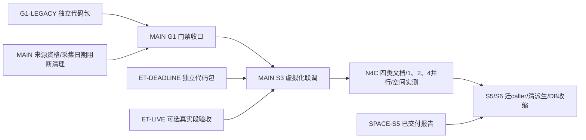

# 并行总计划：门禁先行，独立目录施工，MAIN统一打通

> 2026-10-04复核。补充[task_plan](task_plan.md)，不产生第二套全项目顺序。G1/S3已收口，当前N4C，随后S5/S6。当前三张ready卡见下方“新增三张互斥施工卡”；ready不等于running。其余同日较早章节为历史过程，不再产生待办。

## 现在能交给外部harness的包

| 线 | 状态 | 独占实际工作目录 | 内容/责任 | 独立施工卡 |
|---|---|---|---|---|
| MAIN/root | active | `C:\Users\郑曾波\Projects\company-wiki` 当前根 | 来源核心、共享CLI/Contract、Store/预算、总PWF、配置发布与全部合入 | [G1细则](gate_simplification_closeout_2026-10-04.md)、[总计划](task_plan.md) |
| ET-DEADLINE | complete，已合入main63c4090；不重派 | `C:\Users\郑曾波\Projects\earnings-transcripts-s3-deadline` | 两个正式采集入口硬deadline、进程回收、原协议/语言/hash不变 | [ET独立代码包](harness_lanes/et_retrieval_deadline_closeout.md) |
| ET-LIVE | 完成一次授权尝试；HTTP 402，导入NOT RUN | `C:\Users\郑曾波\Projects\company-wiki-et-live-20261004` | 单次真实ET取数尝试与隔离报告；确定性CWP/FF测试已通过；未改生产仓 | [只读验收报告](C:/Users/郑曾波/Projects/company-wiki-et-live-20261004/report.md) |

这三个实际目录互不包含，也不进入MAIN当前工作树施工。各卡列精确写集。共享Git对象库不等于共享工作目录；各线用自己的index/codex分支，MAIN负责最后合入。Git切主线/合入期间交付线冻结，不并发改同一目标分支。

ET-DEADLINE独占worktree仍未提交。MAIN只读集中责任包91 passed、1 failed；唯一失败测试把API捕获的`RuntimeError`误当成worker异常退出，见task_plan下一步；MAIN未改外线写集。ET-LIVE只读报告已交付：一次FMP GET被HTTP 402拒绝，不重试，临时根已清理。没有交付消息不推测代码线完成；目录已存在先核身份/status，不reset不明工作。

## 已交付，不再重新启动

| 原线 | 当前事实 | 后续归属 |
|---|---|---|
| FF-S3 | `1d0c73c`与SourceRef v2资格收敛`e1eda60`已推远端main；当前FF聚焦回归177 passed / 1 skipped / 39 subtests，正常push gate GREEN | MAIN处理S3 live接口验收与安装/provider可移植配置 |
| ET-S3 | 已合ET main `93fe52c`；现代入口/旧薄batch/默认原语言已收敛 | ET-DEADLINE仅补真实截止缺口，不重做ET-S3 |
| G1-LEGACY | 外包交付 commit `1cf8183` 已并入 CWP `6394271`；handoff已保存；集中回归`170 passed, 1 deselected` | 外线写集关闭；G1全节点已完成，MAIN转入S3真实电话会导入验收 |
| SPACE-S5 | `company-wiki-storage-audit-20261003/results/storage_audit.{json,md}`交付，15项审计工具测试绿；零生产修改 | S5/S6由MAIN执行删除/迁caller，不重派空间审计 |
| StockWiki W01/W04、工程门简化、SourceExport、Identity、G-C消费者 | 各自既有交付/收据保留 | 不以新包重复实现；active owner树只读 |

## MAIN职责与当前施工

1. CWP来源reader/as-of/resolver/gap_plan/canonical_writer与FF SourceRef v2资格门已按TDD收敛；真实SHA、身份/期次/公开日、可回放locator保持自动验证，采集描述缺失仅诊断。
2. G1-LEGACY旧入口退役及46项当前状态分类完成；CloseGapBinding、旧whole-catalog LLM summarizer及archive/prune代码未发现生产caller，不作为用户门，后续若无调用者随S5/S6清理。
3. G1/S3已完成，ET-DEADLINE已集中验收并合入main63c4090。ET-LIVE一次请求被FMP HTTP 402拒绝，尚无live原文导入。MAIN正在推进N4C；当前独立包为N4-T1/T2及MeetingConverter CI，不重派已交付旧包。
4. 接收外线commit与短报告，核diff/接口/相关测试，解决冲突和跨仓接线。MAIN统一发布；外线不自己合main、不写他仓、不安装全局技能。
5. 测试全用独立根，退出恢复原样；不丢原件。不造签名、人工授权文件、每helper审批或固定场景数。

## 交接接口（冻结，避免各线自创合同）

### I1 已有 FF→CWP，复用

SourceRef 2.0、SourceExport v2、现有FF v2 request/result不变。上层传ID/hash/locator，不传存储目录；CWP独占来源DB与原件保存。

实际下载限额已经进入CWP→CNINFO bounded provider；配置与请求取更严格值，共享bytes/deadline/cost，不靠JSON校验冒称执行限额。latest_as_of的metadata查询预算沿用现有合同；reuse和是否补采分别控制。BYD FY2024下载10,092,140 B、raw和SourceRef SHA/size相符，latest_as_of只读复用及legacy精确复用没有新增文件。Dayu不改，不能执行所需硬上限则外发前具名失败。

### I2 已有 FF→ET→CWP电话会，协议不变

FF工具位置取 `EARNINGS_TRANSCRIPTS_TOOL`，调用 `--request-stdin --include-source-payload`。request `/1`、现有payload result `/2`、CWP import request `/2`与response `/3`不变；精确市场/证券/FY/Q，不从年报猜Q4、不翻译。ET不直接写CWP；CWP importer保存原件。

ET-DEADLINE只改变内部执行边界。ET-LIVE只证明真实ET工具→临时CWP导入段，FF companion确定性路由另记；如果确实经正式FF入口完成一次live才可以声明完整FF live链。工具不可用时NOT RUN，不用mock伪造真实权益。

### I3 G1-LEGACY→MAIN

**已完成并入。**保留 `enforce_direct_cli`、`legacy_script_execution_allowed`、`is_legacy_script_cli`的现有签名，environment薄兼容但不作为人工许可。支持来源/维护入口可以执行；永久退休研究writer仍退出78；删已完成一次性工具，不动历史事实文件。接收偏差及主线补测记录见G1 handoff。

### I4 ET-DEADLINE→MAIN

正式tool/batch统一内部supervisor；内部operation/request/剩余额度→原wire result+内部usage。内部usage不塞进外部协议。原始语言、期间、payload/hash/size与golden不变。硬限制范围是provider采集，显式旧翻译不冒称受该deadline约束。

超时按一个有限清理宽限回收自建worker；未知usage不当0且停批。原件保存仍由parent完成，已完成文件不回滚。交接提供真实subprocess elapsed/退出/共享deadline测试，不拿最终异常当及时停止。

### I5 只读验收/空间审计→MAIN

ET-LIVE独占报告已交：工具调用1次、FMP GET 1次、HTTP 402（由`provider_entitlement_required`映射；公共结果未返回status字段）、FY2026 Q3、原语言请求、10秒/1MB、没有重试；未取得正文，故未运行导入/SourceRef。确定性测试分别CWP 7 passed、FF 17 passed；临时根清理且CWP生产配置指纹未变。详情见独占目录`report.md`；这份报告完成验收记录，但不代表live source链通过。

SPACE-S5既有 `storage-audit/1`报告是施工输入。MAIN已完成[首批138,648,023 B/923文件清理](harness_lanes/results/s5_first_cache_cleanup_2026-10-04.md)，保护快照和四份原件正式CLI前后实读均通过，不重派不重复计算收益。derived 2,826,010,634 B仍有RF旧默认读取、CWP section入口及8,191条artifact引用；按[实施细则](s5_s6_legacy_storage_implementation.md)先迁caller。DB单独VACUUM不能释放旧全量span占用；原件不进删除候选。

## 依赖图与合入顺序

没有“所有外线交完才开始MAIN”的屏障。MAIN可先做G1核心、先合已绿G1包；ET代码交付暂存到S3。live不可用不阻G1，但S3不能虚报真实段成功。

## 当前外仓owner边界

正常用户只读Git快照2026-10-04：CWP master `376ed90`仅本机provider配置dirty；RF rf-impl main `6fb2def7`有242项owner记录，RF fcap `5319ee26`只有2项assurance文件变化；FF fcap `1d0c73c`只有未跟踪key；ET main `93fe52c`只有2项旧工具未跟踪记录。RF两个树不要混计。

StockWiki/IQS仍有owner工作；IQS明确只把CWP作为可选只读深研链接，不自动镜像/下载文档。RF/StockWiki已有pathless消费者，不再另开消费者代码包。Dayu纯外部，零修改。

CWP机器特定 `config/source_acquisition.yaml` 指向StockInfo隔离bounded provider工作树，未发布；可移植安装由MAIN收口，不让外线从该dirty配置开始。原StockInfo owner工作树保留，不并行跨仓修改。

## 验收和发布节奏

每个代码包只有三个自然阶段：读基线/目标RED→实现/责任包GREEN→本线commit/push+短handoff。所有局部PWF、测试和报告只在本线目录。交付包含base/head、改动路径、接口/golden、命令/结果、测试目录恢复、未完成事实；不交大执行日志、完整资料副本、key或备份。

MAIN只在G1、S3、N4 B/C、S5/S6几个大节点复核。无逐helper/逐文档/逐删除文件审查。已有轻量Git/CI照常；纯文档本轮不重跑业务测试。复杂度/全coverage是按需诊断，不成为交接资格门。

## 2026-10-04 派发与实际目录复核

用户确认两个代码包已发出：G1-LEGACY、ET-DEADLINE写集归外线，MAIN不抢改。Git实读ET三个worktree：正式main在 `earnings-transcripts/earnings-transcripts@93fe52c`；旧ET-S3 runtime为 `53e1e60`且已合main；新deadline为 `codex/et-s3-deadline@93fe52c`，由本次外包使用。外层earnings-transcripts是容器目录，没有自身.git。

这些worktree共享Git历史，不复制生产CWP资料库；工作目录各自包含代码与已跟踪样本，所以样本文件可能有副本。只读核查旧runtime：跟踪文件干净、无未跟踪文件，53e1e60已在正式main历史中；有130个已跟踪transcripts文件、ignored本地config.json与缓存。旧runtime可在保留本机配置后收尾，本轮不删除。新deadline保留到外包交付/合入结束。目录存在只证明工作树已创建，不代表worker/process仍在运行。

## 2026-10-04 跨仓写集复核

RF `fcap@5319ee26`相对merge-base `ee0a82bfd1eec935cf4e567eb42f0ef79efa0226`没有SourceRef v2消费者代码提交；当前main `6fb2def7`后加的pathless消费者尚未进入fcap。CWP本轮不写RF；合支线时保留main新增的verified-open链路。

FF `codex/transcript-companion@29085f7`现存工作树改动`fetch_filing.py`/`filing_contracts.py`，与SourceRef v2 capture资格入口重叠。MAIN本轮仅核实，不在正式checkout或companion目录改这两个文件；先读清其提交意图，再决定接续或合流。FF root的API key未读未改。

## 2026-10-04 新增三张互斥施工卡

以下三卡已写成可以单独交给外部harness的完整接口，当前均为READY TO DISPATCH，尚未派发/施工。与之前已验收的StockQAbyLLM、MeetingConverter只读盘点卡区分：这里的MeetingConverter是后续CI零任务根因与快速门施工；若远端最新CI已正常运行测试，卡片要求只交现状证据，不制造无必要改动。

| 卡 | 仓库 | 独占目录与文件写集 | 依赖 / 主线合入 |
|---|---|---|---|
| [N4-T1](harness_lanes/n4_model_transport_diagnostics.md) | company-wiki | 独立worktree；automation/narrative_http_model.py、narrative_model_caller.py及需要时的summarize传递层；三个对应unit测试 | 不依赖N4-T2；不能碰source_catalog、Worker/AUTO、配置、生产数据或总PWF。主线收到后与T2联合验收 |
| [N4-T2](harness_lanes/n4_selective_narrative_coverage.md) | company-wiki | 独立worktree；source_catalog候选、路由、finalize与对应选择/handler测试 | 不依赖N4-T1；不能碰automation模型、Worker/AUTO、配置、生产数据或总PWF。主线收到后与T1联合验收 |
| [MeetingConverter CI快速门](harness_lanes/meetingconverter_ci_fast_gate.md) | MeetingConverter | 独立仓库worktree；限定CI workflow、可选的专用workflow合同测试与独立handoff | 与CWP及N4C无依赖，不进主线关键路径；最新CI若已修复则只报告，不改代码 |

N4-T1与N4-T2目录和测试文件互斥。并行时使用两个worktree，从同一提交基线开始；串行时可共用一个专用worktree，T1测试结束并提交后T2接续，以T1交付HEAD为T2的base，分别报告各自的commit范围。无需额外人工签收才能接续T2，但不得共用MAIN活动checkout或同时在一个目录施工。任何共享接口需求写入交接说明，由MAIN处理，worker不得扩写写集或私自合main。独立提交后，MAIN依次集成、运行两卡聚焦包、跨层Worker/本地模型端到端测试；离线合同和真实样本来源校验通过后开始新的有限真实运行。两条代码线不自行调用付费模型或写生产数据。

MeetingConverter使用独立Git仓库，不改变CWP、StockQAbyLLM、IQS或转录资料，因此可和N4-T1/T2同时施工。IQS不在本批可派发工作中，保持用户已明确的排除边界。

## 2026-10-04 G1-LEGACY 接收与主线收口

外包分支 `codex/g1-legacy-entry-retirement@1cf8183` 基于 `1cfec10`，handoff 已复制到 `harness_lanes/results/g1_legacy_entry_retirement_handoff_2026-10-04.md`。代码退役六个一次性 archive/retirement 工具及其专属测试，保留来源/维护 CLI 兼容入口。主线另修复 handoff 漏测的 `source_catalog_pilot_check.py`：它此前只导入 `enforce_direct_cli`，没有实际调用；同时清掉 clean-env 与 deployment 中已废弃的双环境许可残项，并更新旧共享行为测试。

集中主线回归：相关入口/兼容测试 **170 passed, 1 deselected**；单独针对新增行为的组 **27 passed**；Ruff 与 staged/unstaged `git diff --check` 通过。唯一 deselect 是包内全仓 Git 写集断言：外包原隔离工作树已通过，合入主仓后该断言会把本次有意的主线改动也算成包越界。外包 handoff 的该处收据与主线实际回归均保留。机器专用 `config/source_acquisition.yaml` 未纳入合并。

G1-LEGACY 写集已关闭；G1 总阶段仍因 FF SourceRef v2 资格门而保持进行中。ET-DEADLINE 继续在独立 worktree 施工，不合并到本次范围。
