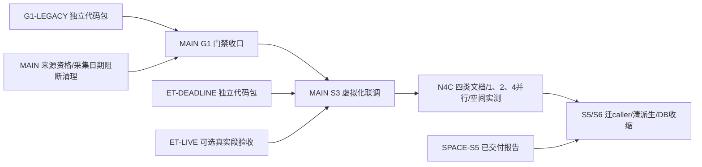

# 并行总计划：门禁先行，独立目录施工，MAIN统一打通

> 2026-10-04复核。补充[task_plan](task_plan.md)，不产生第二套全项目顺序。当前先G1门禁精简，再S3虚拟化，随后N4C及S5/S6。旧交付线不重派；ready不等于running。

## 现在能交给外部harness的包

| 线 | 状态 | 独占实际工作目录 | 内容/责任 | 独立施工卡 |
|---|---|---|---|---|
| MAIN/root | active | `C:\Users\郑曾波\Projects\company-wiki` 当前根 | 来源核心、共享CLI/Contract、Store/预算、总PWF、配置发布与全部合入 | [G1细则](gate_simplification_closeout_2026-10-04.md)、[总计划](task_plan.md) |
| G1-LEGACY | dispatched（用户确认），交付待回报 | `C:\Users\郑曾波\Projects\company-wiki-g1-legacy` | 旧入口双环境许可简化、6个完成运维脚本及专属测试退役；不改src/共享Contract/config | [G1独立代码包](harness_lanes/g1_legacy_entry_and_retirement.md) |
| ET-DEADLINE | dispatched（用户确认），worktree已创建，交付待回报 | `C:\Users\郑曾波\Projects\earnings-transcripts-s3-deadline` | 两个正式采集入口硬deadline、进程回收、原协议/语言/hash不变 | [ET独立代码包](harness_lanes/et_retrieval_deadline_closeout.md) |
| ET-LIVE | ready，可选小包 | `C:\Users\郑曾波\Projects\company-wiki-et-live-20261004` | 一次真实ET取数→临时CWP导入→pathless回读；FF路由另记确定性测试，不改生产仓 | [只读验收包](harness_lanes/et_transcript_live_import_acceptance.md) |

这三个实际目录互不包含，也不进入MAIN当前工作树施工。各卡列精确写集。共享Git对象库不等于共享工作目录；各线用自己的index/codex分支，MAIN负责最后合入。Git切主线/合入期间交付线冻结，不并发改同一目标分支。

用户启动后在本对话报线名，root登记running，并从那时起不实施该写集。没有交付消息不推测完成；目录已存在先核身份/status，不reset不明工作。ET-LIVE使用稳定已发布ET main，不读ET-DEADLINE正在变化的目录，因此两者也能并行。

## 已交付，不再重新启动

| 原线 | 当前事实 | 后续归属 |
|---|---|---|
| FF-S3 | `1d0c73c`已推FF main；CI37182527153 success；实际限额/精确复用/latest-as-of元数据预算与CNINFO闭环 | MAIN只处理接口受影响联调与安装配置 |
| ET-S3 | 已合ET main `93fe52c`；现代入口/旧薄batch/默认原语言已收敛 | ET-DEADLINE仅补真实截止缺口，不重做ET-S3 |
| SPACE-S5 | `company-wiki-storage-audit-20261003/results/storage_audit.{json,md}`交付，15项审计工具测试绿；零生产修改 | S5/S6由MAIN执行删除/迁caller，不重派空间审计 |
| StockWiki W01/W04、工程门简化、SourceExport、Identity、G-C消费者 | 各自既有交付/收据保留 | 不以新包重复实现；active owner树只读 |

## MAIN职责与当前施工

1. reader的URL/collector描述门与叙述capture截止已按TDD清理；来源/CLI/叙述64项回归绿。下一组收敛resolver/gap_plan/canonical_writer与FF的残留资格门，保capture_ready/gaps只作真实诊断。query_local公开日默认保持。
2. 接收G1-LEGACY的函数兼容与删脚本diff，更新共享Contract/clean_env_gate/AGENTS引用。源层archive/prune的真实CLI漏now问题由MAIN修复或正式退役，不能交脚本线修改src。
3. G1一次集中责任包GREEN后普通合入/push；再处理S3安装/provider可移植配置与ET接口联调。外线可以提前准备ET代码，不改变MAIN合入优先级。
4. 接收外线commit与短报告，核diff/接口/相关测试，解决冲突和跨仓接线。MAIN统一发布；外线不自己合main、不写他仓、不安装全局技能。
5. 测试全用独立根，退出恢复原样；不丢原件。不造签名、人工授权文件、每helper审批或固定场景数。

## 交接接口（冻结，避免各线自创合同）

### I1 已有 FF→CWP，复用

SourceRef 2.0、SourceExport v2、现有FF v2 request/result不变。上层传ID/hash/locator，不传存储目录；CWP独占来源DB与原件保存。

实际下载限额已经进入CWP→CNINFO bounded provider；配置与请求取更严格值，共享bytes/deadline/cost，不靠JSON校验冒称执行限额。latest_as_of的metadata查询预算沿用现有合同；reuse和是否补采分别控制。BYD FY2024下载10,092,140 B、raw和SourceRef SHA/size相符，latest_as_of只读复用及legacy精确复用没有新增文件。Dayu不改，不能执行所需硬上限则外发前具名失败。

### I2 已有 FF→ET→CWP电话会，协议不变

FF工具位置取 `EARNINGS_TRANSCRIPTS_TOOL`，调用 `--request-stdin --include-source-payload`。request `/1`、现有payload result `/2`、CWP import request `/2`与response `/3`不变；精确市场/证券/FY/Q，不从年报猜Q4、不翻译。ET不直接写CWP；CWP importer保存原件。

ET-DEADLINE只改变内部执行边界。ET-LIVE只证明真实ET工具→临时CWP导入段，FF companion确定性路由另记；如果确实经正式FF入口完成一次live才可以声明完整FF live链。工具不可用时NOT RUN，不用mock伪造真实权益。

### I3 G1-LEGACY→MAIN

保留 `enforce_direct_cli`、`legacy_script_execution_allowed`、`is_legacy_script_cli`的现有签名，environment薄兼容但不作为人工许可。支持来源/维护入口可以执行；永久退休研究writer仍退出78；删已完成一次性工具，不动历史事实文件。具体支持/退休分类及MAIN待改共享测试列在独立卡和handoff。

### I4 ET-DEADLINE→MAIN

正式tool/batch统一内部supervisor；内部operation/request/剩余额度→原wire result+内部usage。内部usage不塞进外部协议。原始语言、期间、payload/hash/size与golden不变。硬限制范围是provider采集，显式旧翻译不冒称受该deadline约束。

超时按一个有限清理宽限回收自建worker；未知usage不当0且停批。原件保存仍由parent完成，已完成文件不回滚。交接提供真实subprocess elapsed/退出/共享deadline测试，不拿最终异常当及时停止。

### I5 只读验收/空间审计→MAIN

ET-LIVE独占目录 `report.md`包含实际请求数、commit、period/语言/SHA/size/pathless、临时根恢复和PASS/FAIL/NOT RUN；root采纳摘要，不让外线写CWP结果目录。

SPACE-S5既有 `storage-audit/1`报告是施工输入，不是自动删除授权manifest。首批138,648,023 B候选仍需MAIN核变化；derived 2,826,010,634 B尚有reader及8,191条artifact引用，要先迁caller。DB freelist为0，单独VACUUM不释放空间。原件不进删除候选。

## 依赖图与合入顺序

没有“所有外线交完才开始MAIN”的屏障。MAIN可先做G1核心、先合已绿G1包；ET代码交付暂存到S3。live不可用不阻G1，但S3不能虚报真实段成功。

## 当前外仓owner边界

正常用户只读Git快照2026-10-04：CWP master `376ed90`仅本机provider配置dirty；RF rf-impl main `6fb2def7`有242项owner记录，RF fcap `5319ee26`只有2项assurance文件变化；FF fcap `1d0c73c`只有未跟踪key；ET main `93fe52c`只有2项旧工具未跟踪记录。RF两个树不要混计。

StockWiki/IQS仍有owner工作；IQS明确只把CWP作为可选只读深研链接，不自动镜像/下载文档。RF/StockWiki已有pathless消费者，不再另开消费者代码包。Dayu纯外部，零修改。

CWP机器特定 `config/source_acquisition.yaml` 指向StockInfo隔离bounded provider工作树，未发布；可移植安装由MAIN收口，不让外线从该dirty配置开始。原StockInfo owner工作树保留，不并行跨仓修改。

## 验收和发布节奏

每个代码包只有三个自然阶段：读基线/目标RED→实现/责任包GREEN→本线commit/push+短handoff。所有局部PWF、测试和报告只在本线目录。交付包含base/head、改动路径、接口/golden、命令/结果、测试目录恢复、未完成事实；不交大执行日志、完整资料副本、key或备份。

MAIN只在G1、S3、N4 B/C、S5/S6几个大节点复核。无逐helper/逐文档/逐删除文件审查。已有轻量Git/CI照常；纯文档本轮不重跑业务测试。复杂度/全coverage是按需诊断，不成为交接资格门。

## 2026-10-04 派发与实际目录复核

用户确认两个代码包已发出：G1-LEGACY、ET-DEADLINE写集归外线，MAIN不抢改。Git实读ET三个worktree：正式main在 `earnings-transcripts/earnings-transcripts@93fe52c`；旧ET-S3 runtime为 `53e1e60`且已合main；新deadline为 `codex/et-s3-deadline@93fe52c`，由本次外包使用。外层earnings-transcripts是容器目录，没有自身.git。

这些worktree共享Git历史，不复制生产CWP资料库；工作目录各自包含代码与已跟踪样本，所以样本文件可能有副本。只读核查旧runtime：跟踪文件干净、无未跟踪文件，53e1e60已在正式main历史中；有130个已跟踪transcripts文件、ignored本地config.json与缓存。旧runtime可在保留本机配置后收尾，本轮不删除。新deadline保留到外包交付/合入结束。目录存在只证明工作树已创建，不代表worker/process仍在运行。
