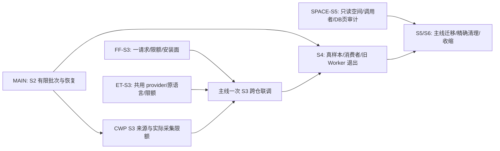

# S2–S6 并行实施总图与总指挥责任

> 2026-10-03 最新施工安排，补充而不替代 [task_plan](task_plan.md)。旧 W01–W04、SourceExport、工程门简化和 G-C 消费线已经交付，不重复派发。本页及各施工卡由 company-wiki 主线 owner 维护；外部 harness 只改各自工作目录。

## 结论与现在能启动的任务

能有效拆成三包。前两包为代码实施，第三包提供下一次空间清理所需的实测和调用者清单。它们都可以现在启动，不依赖 N4 模型批次全部完成；FF 的最终生产限额联调要等主线补齐 producer，不能冒充已经端到端通过。

| 线 | 当前状态 | 独占写入目录 | 本次内容 | 独立卡 |
|---|---|---|---|---|
| MAIN：本对话/root | active | `C:\Users\郑曾波\Projects\company-wiki` | S2 批次/恢复/降容，CWP S3 来源与采集接口，S4 真样本/消费者，S5/S6 清理与所有集成 | [N4](n4_production_batch_implementation.md)、task_plan |
| FF-S3 | ready，尚未派出 | `C:\Users\郑曾波\Projects\filing-fetch-s3-limits` | 一请求、实际限额、v2/薄 v1、文档及安装面收敛 | [FF 独立卡](harness_lanes/s3_filing_fetch_single_request_limits.md) |
| ET-S3 | ready，尚未派出 | `C:\Users\郑曾波\Projects\earnings-transcripts-s3-runtime` | 旧 scraper 与工具共用 provider，原语言、实际限额、有界错误 | [ET 独立卡](harness_lanes/s3_earnings_transcripts_runtime.md) |
| SPACE-S5 | ready，尚未派出 | `C:\Users\郑曾波\Projects\company-wiki-storage-audit-20261003` | 只读 B2 调用者/库页/原件精确重复量，给主线可执行清理批次 | [空间审计卡](harness_lanes/s5_storage_audit.md) |

“ready”表示可以开工，不能解释成有 harness 已经在做。用户启动后把线名交本对话登记为 running；root 从那时起不再实施其仓内工作。没有消息回传也不推测交付。工作目录已存在时先读 status/计划，复用同线可用目录；不覆盖不明目录。

## 总指挥做什么

1. 我独占 CWP、总 PWF、对外 producer 接口和全局 `.agents/.codex` 技能安装；保持 S0–S6 唯一顺序。其他线不能修改这些目录，避免把总计划写成多份状态真相。
2. 冻结以下接口，把未实现状态写明。FF/ET 在自己的仓内按接口做测试和实现；接口变化先交 root 协调，不能各自换版本或改另一仓。
3. 接收各线 commit 和小型交接报告，核实际 diff/相关测试，再做一次跨仓大节点测试。普通 Git 合并；冲突由我处理。root 合并某仓期间该线冻结写入；不要求每个小步骤签收。
4. 我负责真实原件、最终包/消费者、恢复和空间的总体验收；只读审计线没有删除权。测试完恢复独立目录原样；原件仍全部保留。
5. 我统一更新主线进度并及时 commit/push。没有 remote 的项目只报告本地提交，不虚报已推送。外线只 push 自己的 `codex/` 分支，不自行切默认主线/安装全局技能。

## 已冻结接口与真实完成状态

### I1：FF → CWP 来源操作

- 保持现行 SourceRef `2.0`、v2 filing 请求与响应语义；上下游只传 ID/hash，不传原文物理目录，不写共享数据库。
- 当前 FF `acquisition_limits` EXACT 字段：`max_bytes` 正整数、`timeout_seconds` 正有限数、`max_cost_usd` 非负十进制字符串（当前支持最多两位小数）。`reuse_only` 不接受采集额度。
- **本次新增、root 尚待实现的 CWP CLI 参数**：`--max-download-bytes`、`--max-download-seconds`、`--max-download-cost-usd`，供 `ensure` / `close-gap` 写入入口使用。映射为上面三个字段；有效限额取请求、采集配置和剩余执行期限的更严格值。旧调用不带参数时保留配置默认。费用/时间不能塞进来源身份 hash。
- CWP 必须把它们执行到 transport/staging，而非只校验 JSON；FF 对子进程设置剩余 deadline/输出 cap。对旧 producer 未识别参数，FF 具名失败，不能删除限额重试或悄悄走 v1。
- 状态：既有 reader/importer 已交付；新增三参数 **producer pending**。FF 可以现在完成本仓透传/超时测试；root 负责补 producer 与一次正式限额 E2E。

### I2：FF → ET → CWP 电话会

- 工具位置来自 `EARNINGS_TRANSCRIPTS_TOOL`；调用 `--request-stdin --include-source-payload`。
- 请求 `earnings-transcript-request/1`，精确证券/市场/FY/Q；ET 返回现行 `/2`，原语言原始 payload/text/hash；CWP import `/2` 请求、`/3` 响应。年度报告不猜 Q4；无法确定期次零抓取。
- 本次不改 wire 字段/版本、不伪造 FMP publication、不翻译；ET 可加内部执行参数/测试 seam，并保持现有 serializer golden。FF 保持财报/电话会独立结果，电话会失败不回滚财报。
- 状态：现行链与 G-C 已有验收。两线的共同交接是现行 golden 和 CLI，不需要等对方新代码才能写本仓 TDD；最终由 root 重跑受影响路由。

### I3：只读审计 → root 清理

- 一份 `storage-audit/1` JSON + 一份简短 Markdown，字段由空间卡冻结。它是实测/施工输入，不是签名授权或自动删除 manifest。
- root 将“无活动调用者的派生集合”转成 S5 精确删除步骤；“仍有调用者”转成迁移/退休步骤；DB 行删除与 VACUUM 的实际收益归 S6。
- 原件 exact-SHA 重复仅测候选；不把相似文本算可删、不删除 raw、不按 DB 总大小承诺释放量。

## 依赖图

空间审计不等 S4；无依赖集合可以先列出。但清理仍由 root 与当时实际调用者核对后实施。FF/ET 不互相 cherry-pick，也不访问生产 CWP 数据写入；本仓 E2E 使用独立副本。

## 不拆的部分与当前外仓变化

- AUTO Store、预算、factory、批次 coordinator、projector、terminal compaction、来源默认/as-of/fingerprint，共用 CWP 状态与公开接口，保留给主线。不能用“每人不同 Python 文件”冒称项目目录独立。
- RF `rf-impl main@6fb2def7` 的四项未提交 PWF 文件仍由其 owner 保留；`revenue-forecast fcap@5319ee26` 不覆盖。
- StockWiki 已推进到 `aa98848`，四项 quick-scan CLI/maintenance/test 正在写；IQS 已到 `44b805f`，其 PWF 正推进 W07/W08 等。旧 SourceRef/叙述消费已经交付，此处不再开它们第二条实施线。
- FF 常用根还是旧 `fcap@d35b6f5`，真正 `origin/main` 为 `c47c397`，ET main 为 `4924d57`。任务卡指定新独立 worktree 起点，不能从陈旧常用根直接施工。
- 三线只维护自己的局部 PWF 与报告，不写 root 计划、不 reset 他仓、不让 test fixture 写穿生产配置。

## 交接与验收节奏

各线只做三个自然阶段：读基线/先 RED → 仓内实现与一次集中 GREEN → commit/push 自己分支并交接。中间 helper 无人工审查；没有固定场景数量/coverage签收线。交接最少包含 base/head、文件清单、接口/golden、测试命令和结果、清理结果、未完成事实。不要提交每次执行的大日志、完整资料副本、密钥或恢复备份。

root 只在 S3 接口、N4 B/C、S5/S6 存储几个大节点复核和测试。FF/ET 合入后做一次真实正式 CLI 链（HTTP 可本地注入）验证原文入 CWP、refs/语言/期间、实际限额、失败不重复外发及目录恢复；真实 provider 可用性另记，不用 fake 200 冒充 live。

## 本轮新进展及主线下一步

模型/持久预算基础 `9ccd29f` 已推送，CI37135709529成功。正式 CLI/终态降容第一组集中 67 passed/55.05s；同 run 重跑零新增 POST，零费用/小空间 cap 均零 POST，原文改 SHA 后失败仍保留此前费用。这不等于 N4B/C 全完成：root 还负责跨 run 工件幂等、父进程 kill/ACK 窗口、四份真实小批和旧 Worker 退出，见 N4 卡。

已发布cf662cc（正式CLI/终态降容、英文召回、三施工卡），正常hooks/pre-push绿；CI37139201102首次查询运行中。下一步：按用户派出的线登记 owner，同时 root 继续 S2 的恢复/跨 run 收口及 CWP S3 producer 限额。任何任务卡被外部 harness 接走后，该包不再由 root 另起实现。
