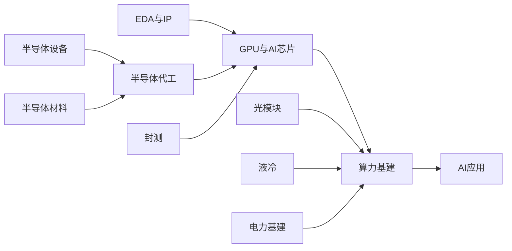

# AI产业链导航

## 产业链全景

## 按产业链层级

### 应用层

**AI应用** — 大模型、AI Agent、行业AI应用
- 公司: [百度](./%E5%85%AC%E5%8F%B8/%E7%99%BE%E5%BA%A6/%E5%85%AC%E5%8F%B8%E5%8A%A8%E6%80%81), [商汤科技](./%E5%85%AC%E5%8F%B8/%E5%95%86%E6%B1%A4%E7%A7%91%E6%8A%80/%E5%85%AC%E5%8F%B8%E5%8A%A8%E6%80%81), [科大讯飞](./%E5%85%AC%E5%8F%B8/%E7%A7%91%E5%A4%A7%E8%AE%AF%E9%A3%9E/%E5%85%AC%E5%8F%B8%E5%8A%A8%E6%80%81)

### 支撑层

**电力基建** — 数据中心电力供应：发电设备、储能、输配电、UPS
- 发电设备: [阳光电源](./%E5%85%AC%E5%8F%B8/%E9%98%B3%E5%85%89%E7%94%B5%E6%BA%90/%E5%85%AC%E5%8F%B8%E5%8A%A8%E6%80%81)
- 储能: [宁德时代](./%E5%85%AC%E5%8F%B8/%E5%AE%81%E5%BE%B7%E6%97%B6%E4%BB%A3/%E5%85%AC%E5%8F%B8%E5%8A%A8%E6%80%81), [阳光电源](./%E5%85%AC%E5%8F%B8/%E9%98%B3%E5%85%89%E7%94%B5%E6%BA%90/%E5%85%AC%E5%8F%B8%E5%8A%A8%E6%80%81)
- 输配电: [东方电缆](./%E5%85%AC%E5%8F%B8/%E4%B8%9C%E6%96%B9%E7%94%B5%E7%BC%86/%E5%85%AC%E5%8F%B8%E5%8A%A8%E6%80%81), [许继电气](./%E5%85%AC%E5%8F%B8/%E8%AE%B8%E7%BB%A7%E7%94%B5%E6%B0%94/%E5%85%AC%E5%8F%B8%E5%8A%A8%E6%80%81)
- 公司: [东方电缆](./%E5%85%AC%E5%8F%B8/%E4%B8%9C%E6%96%B9%E7%94%B5%E7%BC%86/%E5%85%AC%E5%8F%B8%E5%8A%A8%E6%80%81), [许继电气](./%E5%85%AC%E5%8F%B8/%E8%AE%B8%E7%BB%A7%E7%94%B5%E6%B0%94/%E5%85%AC%E5%8F%B8%E5%8A%A8%E6%80%81), [宁德时代](./%E5%85%AC%E5%8F%B8/%E5%AE%81%E5%BE%B7%E6%97%B6%E4%BB%A3/%E5%85%AC%E5%8F%B8%E5%8A%A8%E6%80%81), [阳光电源](./%E5%85%AC%E5%8F%B8/%E9%98%B3%E5%85%89%E7%94%B5%E6%BA%90/%E5%85%AC%E5%8F%B8%E5%8A%A8%E6%80%81)

### 基础设施层

**光模块** — 数据中心光通信模块，AI算力互联核心
- 公司: [中际旭创](./%E5%85%AC%E5%8F%B8/%E4%B8%AD%E9%99%85%E6%97%AD%E5%88%9B/%E5%85%AC%E5%8F%B8%E5%8A%A8%E6%80%81), [新易盛](./%E5%85%AC%E5%8F%B8/%E6%96%B0%E6%98%93%E7%9B%9B/%E5%85%AC%E5%8F%B8%E5%8A%A8%E6%80%81), [天孚通信](./%E5%85%AC%E5%8F%B8/%E5%A4%A9%E5%AD%9A%E9%80%9A%E4%BF%A1/%E5%85%AC%E5%8F%B8%E5%8A%A8%E6%80%81), [光迅科技](./%E5%85%AC%E5%8F%B8/%E5%85%89%E8%BF%85%E7%A7%91%E6%8A%80/%E5%85%AC%E5%8F%B8%E5%8A%A8%E6%80%81), [太辰光](./%E5%85%AC%E5%8F%B8/%E5%A4%AA%E8%BE%B0%E5%85%89/%E5%85%AC%E5%8F%B8%E5%8A%A8%E6%80%81)

**液冷** — AI服务器液冷散热解决方案
- 公司: [英维克](./%E5%85%AC%E5%8F%B8/%E8%8B%B1%E7%BB%B4%E5%85%8B/%E5%85%AC%E5%8F%B8%E5%8A%A8%E6%80%81), [高澜股份](./%E5%85%AC%E5%8F%B8/%E9%AB%98%E6%BE%9C%E8%82%A1%E4%BB%BD/%E5%85%AC%E5%8F%B8%E5%8A%A8%E6%80%81), [申菱环境](./%E5%85%AC%E5%8F%B8/%E7%94%B3%E8%8F%B1%E7%8E%AF%E5%A2%83/%E5%85%AC%E5%8F%B8%E5%8A%A8%E6%80%81), [曙光数创](./%E5%85%AC%E5%8F%B8/%E6%9B%99%E5%85%89%E6%95%B0%E5%88%9B/%E5%85%AC%E5%8F%B8%E5%8A%A8%E6%80%81), [飞龙股份](./%E5%85%AC%E5%8F%B8/%E9%A3%9E%E9%BE%99%E8%82%A1%E4%BB%BD/%E5%85%AC%E5%8F%B8%E5%8A%A8%E6%80%81)

**算力基建** — AI服务器整机、数据中心建设、算力租赁
- 公司: [浪潮信息](./%E5%85%AC%E5%8F%B8/%E6%B5%AA%E6%BD%AE%E4%BF%A1%E6%81%AF/%E5%85%AC%E5%8F%B8%E5%8A%A8%E6%80%81), [中科曙光](./%E5%85%AC%E5%8F%B8/%E4%B8%AD%E7%A7%91%E6%9B%99%E5%85%89/%E5%85%AC%E5%8F%B8%E5%8A%A8%E6%80%81), [工业富联](./%E5%85%AC%E5%8F%B8/%E5%B7%A5%E4%B8%9A%E5%AF%8C%E8%81%94/%E5%85%AC%E5%8F%B8%E5%8A%A8%E6%80%81), [紫光股份](./%E5%85%AC%E5%8F%B8/%E7%B4%AB%E5%85%89%E8%82%A1%E4%BB%BD/%E5%85%AC%E5%8F%B8%E5%8A%A8%E6%80%81)

### 核心器件层

**GPU与AI芯片** — AI训练/推理用GPU、NPU、TPU等专用芯片
- 公司: [英伟达](./%E5%85%AC%E5%8F%B8/%E8%8B%B1%E4%BC%9F%E8%BE%BE/%E5%85%AC%E5%8F%B8%E5%8A%A8%E6%80%81), [AMD](./%E5%85%AC%E5%8F%B8/AMD/%E5%85%AC%E5%8F%B8%E5%8A%A8%E6%80%81), [寒武纪](./%E5%85%AC%E5%8F%B8/%E5%AF%92%E6%AD%A6%E7%BA%AA/%E5%85%AC%E5%8F%B8%E5%8A%A8%E6%80%81), [海光信息](./%E5%85%AC%E5%8F%B8/%E6%B5%B7%E5%85%89%E4%BF%A1%E6%81%AF/%E5%85%AC%E5%8F%B8%E5%8A%A8%E6%80%81), [景嘉微](./%E5%85%AC%E5%8F%B8/%E6%99%AF%E5%98%89%E5%BE%AE/%E5%85%AC%E5%8F%B8%E5%8A%A8%E6%80%81)

**封测** — 芯片封装与测试，包括先进封装(CoWoS, HBM)
- 公司: [长电科技](./%E5%85%AC%E5%8F%B8/%E9%95%BF%E7%94%B5%E7%A7%91%E6%8A%80/%E5%85%AC%E5%8F%B8%E5%8A%A8%E6%80%81), [通富微电](./%E5%85%AC%E5%8F%B8/%E9%80%9A%E5%AF%8C%E5%BE%AE%E7%94%B5/%E5%85%AC%E5%8F%B8%E5%8A%A8%E6%80%81), [甬矽电子](./%E5%85%AC%E5%8F%B8/%E7%94%AC%E7%9F%BD%E7%94%B5%E5%AD%90/%E5%85%AC%E5%8F%B8%E5%8A%A8%E6%80%81)

### 制造层

**半导体代工** — 晶圆代工制造
- 公司: [台积电](./%E5%85%AC%E5%8F%B8/%E5%8F%B0%E7%A7%AF%E7%94%B5/%E5%85%AC%E5%8F%B8%E5%8A%A8%E6%80%81), [中芯国际](./%E5%85%AC%E5%8F%B8/%E4%B8%AD%E8%8A%AF%E5%9B%BD%E9%99%85/%E5%85%AC%E5%8F%B8%E5%8A%A8%E6%80%81), [华虹半导体](./%E5%85%AC%E5%8F%B8/%E5%8D%8E%E8%99%B9%E5%8D%8A%E5%AF%BC%E4%BD%93/%E5%85%AC%E5%8F%B8%E5%8A%A8%E6%80%81)

**EDA与IP** — 芯片设计工具和IP核
- 公司: [华大九天](./%E5%85%AC%E5%8F%B8/%E5%8D%8E%E5%A4%A7%E4%B9%9D%E5%A4%A9/%E5%85%AC%E5%8F%B8%E5%8A%A8%E6%80%81)

### 上游基础层

**半导体设备** — 半导体制造设备：刻蚀、薄膜、清洗、检测、光刻等
- 刻蚀设备: [北方华创](./%E5%85%AC%E5%8F%B8/%E5%8C%97%E6%96%B9%E5%8D%8E%E5%88%9B/%E5%85%AC%E5%8F%B8%E5%8A%A8%E6%80%81), [中微公司](./%E5%85%AC%E5%8F%B8/%E4%B8%AD%E5%BE%AE%E5%85%AC%E5%8F%B8/%E4%B8%AD%E5%BE%AE%E5%85%AC%E5%8F%B8_slides)
- 薄膜沉积设备: [北方华创](./%E5%85%AC%E5%8F%B8/%E5%8C%97%E6%96%B9%E5%8D%8E%E5%88%9B/%E5%85%AC%E5%8F%B8%E5%8A%A8%E6%80%81), [拓荆科技](./%E5%85%AC%E5%8F%B8/%E6%8B%93%E8%8D%86%E7%A7%91%E6%8A%80/%E5%85%AC%E5%8F%B8%E5%8A%A8%E6%80%81)
- 量检测设备: [精测电子](./%E5%85%AC%E5%8F%B8/%E7%B2%BE%E6%B5%8B%E7%94%B5%E5%AD%90/%E5%85%AC%E5%8F%B8%E5%8A%A8%E6%80%81)
- 清洗设备: [北方华创](./%E5%85%AC%E5%8F%B8/%E5%8C%97%E6%96%B9%E5%8D%8E%E5%88%9B/%E5%85%AC%E5%8F%B8%E5%8A%A8%E6%80%81), [盛美上海](./%E5%85%AC%E5%8F%B8/%E7%9B%9B%E7%BE%8E%E4%B8%8A%E6%B5%B7/%E5%85%AC%E5%8F%B8%E5%8A%A8%E6%80%81)
- CMP设备: [华海清科](./%E5%85%AC%E5%8F%B8/%E5%8D%8E%E6%B5%B7%E6%B8%85%E7%A7%91/%E5%85%AC%E5%8F%B8%E5%8A%A8%E6%80%81)
- 公司: [北方华创](./%E5%85%AC%E5%8F%B8/%E5%8C%97%E6%96%B9%E5%8D%8E%E5%88%9B/%E5%85%AC%E5%8F%B8%E5%8A%A8%E6%80%81), [中微公司](./%E5%85%AC%E5%8F%B8/%E4%B8%AD%E5%BE%AE%E5%85%AC%E5%8F%B8/%E4%B8%AD%E5%BE%AE%E5%85%AC%E5%8F%B8_slides), [拓荆科技](./%E5%85%AC%E5%8F%B8/%E6%8B%93%E8%8D%86%E7%A7%91%E6%8A%80/%E5%85%AC%E5%8F%B8%E5%8A%A8%E6%80%81), [盛美上海](./%E5%85%AC%E5%8F%B8/%E7%9B%9B%E7%BE%8E%E4%B8%8A%E6%B5%B7/%E5%85%AC%E5%8F%B8%E5%8A%A8%E6%80%81), [华海清科](./%E5%85%AC%E5%8F%B8/%E5%8D%8E%E6%B5%B7%E6%B8%85%E7%A7%91/%E5%85%AC%E5%8F%B8%E5%8A%A8%E6%80%81), [精测电子](./%E5%85%AC%E5%8F%B8/%E7%B2%BE%E6%B5%8B%E7%94%B5%E5%AD%90/%E5%85%AC%E5%8F%B8%E5%8A%A8%E6%80%81)

**半导体材料** — 硅片、光刻胶、靶材、电子特气、CMP材料等
- 硅片: [沪硅产业](./%E5%85%AC%E5%8F%B8/%E6%B2%AA%E7%A1%85%E4%BA%A7%E4%B8%9A/%E5%85%AC%E5%8F%B8%E5%8A%A8%E6%80%81)
- 光刻胶: [南大光电](./%E5%85%AC%E5%8F%B8/%E5%8D%97%E5%A4%A7%E5%85%89%E7%94%B5/%E5%85%AC%E5%8F%B8%E5%8A%A8%E6%80%81)
- 电子特气: [华特气体](./%E5%85%AC%E5%8F%B8/%E5%8D%8E%E7%89%B9%E6%B0%94%E4%BD%93/%E5%85%AC%E5%8F%B8%E5%8A%A8%E6%80%81)
- 靶材CMP: [江丰电子](./%E5%85%AC%E5%8F%B8/%E6%B1%9F%E4%B8%B0%E7%94%B5%E5%AD%90/%E5%85%AC%E5%8F%B8%E5%8A%A8%E6%80%81)
- 公司: [沪硅产业](./%E5%85%AC%E5%8F%B8/%E6%B2%AA%E7%A1%85%E4%BA%A7%E4%B8%9A/%E5%85%AC%E5%8F%B8%E5%8A%A8%E6%80%81), [南大光电](./%E5%85%AC%E5%8F%B8/%E5%8D%97%E5%A4%A7%E5%85%89%E7%94%B5/%E5%85%AC%E5%8F%B8%E5%8A%A8%E6%80%81), [华特气体](./%E5%85%AC%E5%8F%B8/%E5%8D%8E%E7%89%B9%E6%B0%94%E4%BD%93/%E5%85%AC%E5%8F%B8%E5%8A%A8%E6%80%81), [江丰电子](./%E5%85%AC%E5%8F%B8/%E6%B1%9F%E4%B8%B0%E7%94%B5%E5%AD%90/%E5%85%AC%E5%8F%B8%E5%8A%A8%E6%80%81)

### Tier 99

